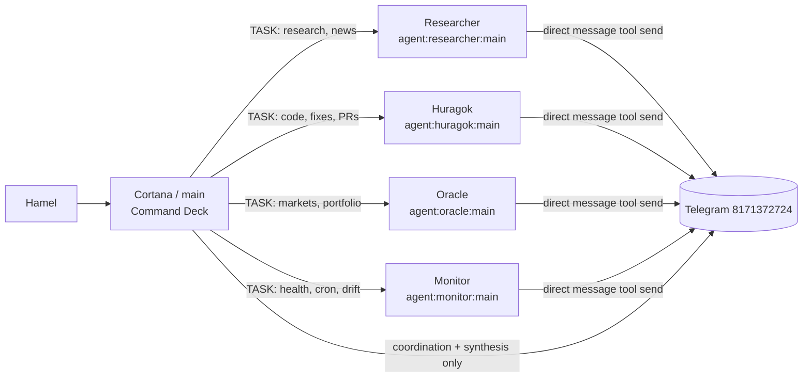
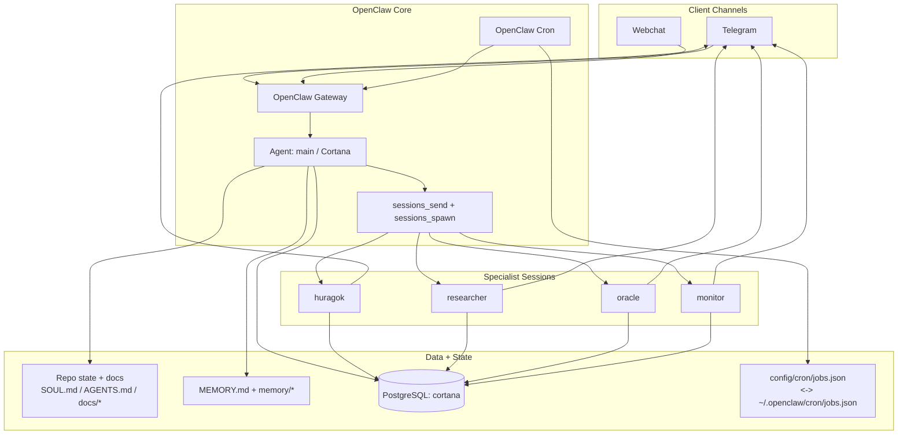
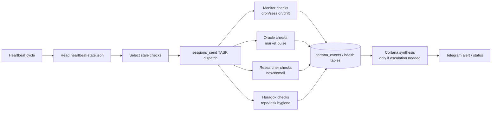

# Cortana Command Brain (`~/openclaw`)

[](https://github.com/hd719/cortana/actions/workflows/ci.yml)

This repo is the **operating brain** for Hamel’s OpenClaw stack.

- `~/openclaw` = policy, routing, memory, cron instructions, operations docs
- `~/Developer/cortana-external` = external runtime/services/UI integrations

---

## 1) Current operating posture (as of 2026-03-05)

### Cortana role (hard rule)
Cortana is **command deck / orchestrator**:
- decide
- route
- verify
- synthesize

Cortana is **not** default bench implementer.

### Delegation model (live)
- Code changes, implementation, and PR work route to specialists (primarily **Huragok**) unless Hamel explicitly requests direct execution.
- Inter-agent `sessions_send` lanes are **TASK-only** (no FYI/status chatter).
- If specialist already delivers directly to Hamel, Cortana does not duplicate relay.

### Channel hygiene target
Cortana lane should stay high-signal:
- coordination
- decisions
- blockers
- verified status

Routine cron/ops noise should route to specialist accounts.

---

## 2) Agent routing (Covenant lanes)



### Ownership boundaries
- **Cortana (main):** orchestration, judgment, routing, verification, escalation
- **Huragok:** implementation, code maintenance, repo workflows, PR creation
- **Researcher:** news/research synthesis and information gathering
- **Oracle:** market/premarket/portfolio intelligence
- **Monitor:** runtime health, cron delivery, drift/reliability checks

---

## 3) Runtime architecture



---

## 4) Mission-control / ops signal flow



### Escalation contract
Any alert must include:
1. failing check/system
2. likely root cause
3. action already taken (or required)
4. next action + ETA/risk

---

## 5) Enforced execution rules (operator quick reference)

## DO
- Stay on command deck: decide, route, verify, synthesize.
- Delegate implementation and PR work to specialists by default.
- Use `sessions_send` for **TASK-only** inter-agent traffic.
- Verify before claiming status (CI/cron/runtime checks).
- Admit mistakes quickly, correct quickly, close loop.

## DON’T
- Don’t self-author PRs by default.
- Don’t use execution lanes for FYI/status chatter.
- Don’t duplicate specialist-delivered outputs.
- Don’t flood Cortana lane with cron noise.
- Don’t claim green without verification.

Primary source files:
- `SOUL.md`
- `docs/operating-rules.md`
- `docs/agent-routing.md`
- `AGENTS.md`

---

## 6) Critical files and responsibilities

- `SOUL.md` — command-brain behavioral source of truth
- `AGENTS.md` — slim map + boot order + pointers
- `docs/operating-rules.md` — hard operating constraints and delegation rules
- `docs/agent-routing.md` — channel/agent routing architecture
- `HEARTBEAT.md` — heartbeat policy and delegated check model
- `config/cron/jobs.json` — repo cron source (synced with runtime jobs.json)
- `MEMORY.md` + `memory/*.md` — durable continuity

---

## 7) Cron delivery routing model

Cron jobs should send through specialist delivery accounts where mapped.
Cortana/default lane should remain narrow (high-signal only).

Current policy pattern in prompts:
- explicit `message` tool delivery instructions
- explicit `channel: telegram`
- explicit `target: 8171372724`
- explicit mapped `accountId` when required by routing

---

## 8) Repo workflow

```bash
git checkout main
git pull --ff-only
# branch from fresh main
git checkout -b <branch>
```

Rules:
- keep docs consistent with shipped behavior
- avoid stale branch drift
- verify CI before claiming completion

---

## 9) Operator quick checks

```bash
# Cron definitions
openclaw cron list

# Gateway health
openclaw gateway status

# Session overview
openclaw sessions --all-agents --active 120

# Database reachability
/opt/homebrew/opt/postgresql@17/bin/psql cortana -c "select now();"
```

---

## 10) Scope

This is a **single-operator personal command system** for Hamel’s machine and workflows.
It is not packaged as a generic SaaS framework.

**Last refreshed:** 2026-03-05
